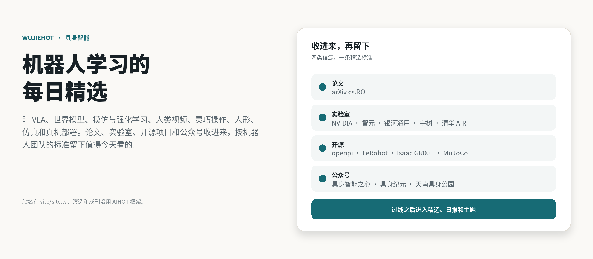
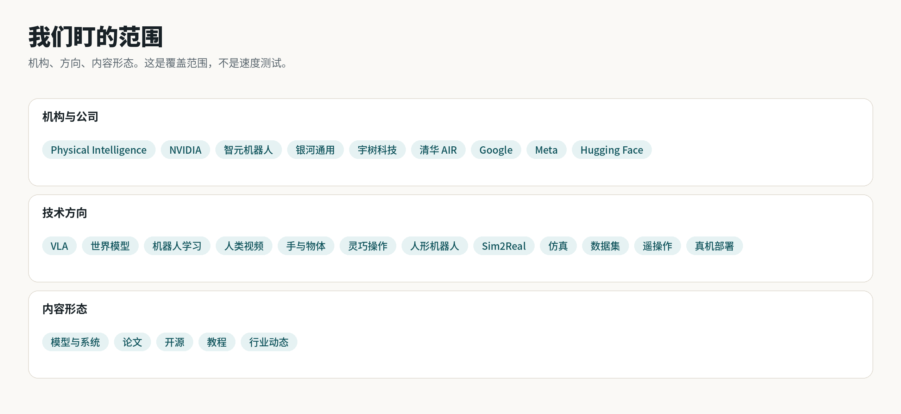
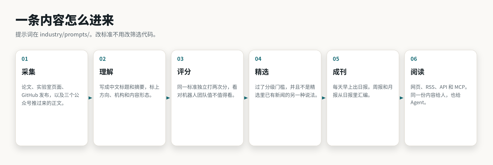
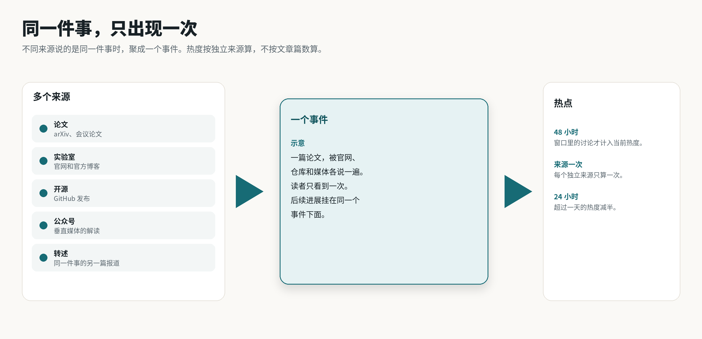
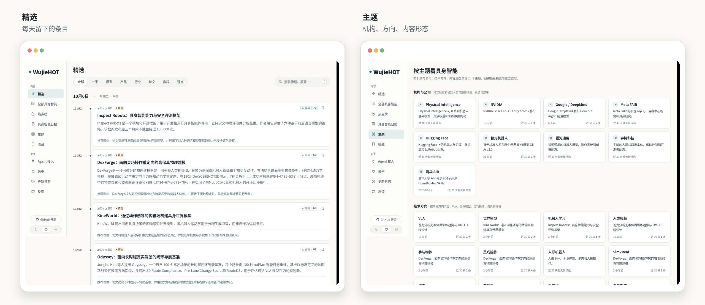

<p align="center">
  <picture>
    <source media="(prefers-color-scheme: dark)" srcset="docs/assets/banner-dark.png">
    
  </picture>
</p>

<p align="center">
  <a href="LICENSE"></a>
  
  
  
  <a href="https://github.com/KKKKhazix/AIHOT"></a>
</p>

<p align="center">
  <b>WujieHOT 是给机器人学习团队看的具身智能热点站。</b><br>
  盯 VLA、世界模型、模仿与强化学习、人类视频、灵巧操作、人形、仿真和真机部署。<br>
  筛选、成刊和网页来自开源框架 <a href="https://github.com/KKKKhazix/AIHOT">AIHOT</a>。
</p>

<p align="center">
  <a href="#我们盯什么">我们盯什么</a> ·
  <a href="#一条内容怎么进来">怎么工作</a> ·
  <a href="#跑起来">跑起来</a> ·
  <a href="#文档">文档</a> ·
  <a href="#致谢">致谢</a>
</p>

<br>

## 这是什么

WujieHOT 每天从论文、实验室、开源项目和垂直公众号里收资料，用大模型先筛一遍、再独立打两次分，留下对机器人团队值得看的内容，写成中文标题和摘要。不同来源说的同一件事合成一个事件。默认每天早上 8 点出一份日报。

这个仓库是我们自己的站：站名、主题、评分标准和信源都按具身智能改过。采集、评分、聚簇、成刊和网页仍是 AIHOT 的引擎。

## 我们盯什么

<picture>
  <source media="(prefers-color-scheme: dark)" srcset="docs/assets/coverage-dark.png">
  
</picture>

机构看 Physical Intelligence、NVIDIA、智元机器人、银河通用、宇树科技、清华 AIR，以及和机器人学习有关的 Google、Meta、Hugging Face。

方向看 VLA、世界模型、机器人学习、人类视频、手与物体、灵巧操作、人形、Sim2Real、仿真、数据集、遥操作和真机部署。

通用大模型发布、融资、奖项和招聘不在这套评分里加分。主题和标签在 [`industry/topics.json`](industry/topics.json)、[`industry/taxonomy.ts`](industry/taxonomy.ts)。

## 一条内容怎么进来

<picture>
  <source media="(prefers-color-scheme: dark)" srcset="docs/assets/how-dark.png">
  
</picture>

一条资料先判重，再预筛。可能重要的，按同一标准独立打两次分，写成中文标题和摘要，再和其他报道聚成事件。分数过了这条信源对应的门槛，又不是精选里已有新闻的另一种说法，才进精选。日报按规则编出当天要闻，周报和月报从日报里汇编。

提示词在 [`industry/prompts/`](industry/prompts/)，门槛在 [`industry/selection.ts`](industry/selection.ts)。改标准不用改筛选代码。细节见 [精选与校准](docs/selection.md)。

### 同一件事只出现一次

<picture>
  <source media="(prefers-color-scheme: dark)" srcset="docs/assets/cluster-dark.png">
  
</picture>

同一件事，论文、官网、仓库和媒体会各说一遍。WujieHOT 把它们聚成一个事件：先在最近两周里找候选，再让模型判断是同一件事、后续进展，还是两件事。热度按事件算，不按文章篇数算。48 小时内每个独立来源只算一次，超过 24 小时减半。

## 站上有什么

| | |
|---|---|
| **信源** | arXiv cs.RO，实验室和公司页面，GitHub 发布，机器人方向的媒体，以及三个公众号。公众号不走站内抓取，由外部脚本推进来 |
| **精选** | 预筛之后独立打两次分，再按信源分级决定进不进。同一条新闻只占一条 |
| **写作** | 中文标题、先给结论的摘要、推荐理由。分类和标签按具身智能的方向与机构来 |
| **主题** | 机构、技术方向、内容形态。主题页从这些标签里取最新精选 |
| **日报、周报、月报** | 默认每天 8:00 出日报，每周一 10:00 出周报，每月 1 日 10:30 出月报。时间在 `site/site.ts` 的 `EDITION_TIMES` |
| **给 Agent 用** | RSS、公开 API、MCP。工具名前缀是 `wujiehot` |
| **后台** | `/admin`。信源、诊断、评分和运行记录 |

## 看一眼

<picture>
  <source media="(prefers-color-scheme: dark)" srcset="docs/assets/shots-dark.png">
  
</picture>

<p align="center"><sub>2026 年 10 月 6 日，本机正在跑的 WujieHOT。左边是精选，右边是主题。</sub></p>

## 公众号

「具身智能之心」「具身纪元」「天南具身公园」走第三方项目 [zlzchat](https://github.com/565800105/zlzchat)。它用微信读书账号订阅公众号并给出 Atom。本仓库的脚本再打开文章页，把正文推进来。

zlzchat 以 git submodule 放在 `third_party/zlzchat`，我们不改它的代码。部署和定时推送写在 [integrations/wechat-rss](integrations/wechat-rss/README.md)。文章进不进精选，仍由 WujieHOT 的评分决定。

## 跑起来

这是私人仓库。需要 [Docker](https://docs.docker.com/get-started/get-docker/)、[Node.js 24](https://nodejs.org/en/download)，和一个 OpenAI 兼容的模型 API Key。

```bash
git clone --recurse-submodules git@github.com:Pytorchlover/WujieHOT.git
cd WujieHOT
node scripts/init-env.ts --llm-key <你的模型 API Key>
docker compose up -d --build
```

打开 <http://localhost:3000>。后台在 `/admin`，管理员密码在 `.env` 的 `ADMIN_PASSWORD`。公众号还要再按 [integrations/wechat-rss](integrations/wechat-rss/README.md) 启动 zlzchat。

不用 Docker、要配域名，或者机器在中国大陆，见 [部署](docs/deploy.md)。

## 要改的地方

站名、主题和评分几乎都在 [`site/`](site/) 和 [`industry/`](industry/)：

| 文件 | 改什么 |
|---|---|
| `site/site.ts` | 站名、行业词、出刊时间、首页文案 |
| `industry/taxonomy.ts`、`industry/topics.json` | 分类、标签、主题 |
| `industry/sources.json` | 首次启动时导入的信源 |
| `industry/prompts/` | 什么样的消息值得看，什么样的不值得 |
| `industry/selection.ts` | 入选门槛 |
| `integrations/wechat-rss/` | 公众号订阅和推进站点 |

框架还能改成别的行业，步骤在 [把它改成你的行业](docs/customize.md)。

## 文档

| 文档 | 内容 |
|---|---|
| [把它改成你的行业](docs/customize.md) | 站名、分类、主题、信源、提示词、门槛 |
| [信源](docs/sources.md) | 六种信源、分级、外部推送 |
| [精选与校准](docs/selection.md) | 一条资料怎么变成精选，怎么编进日报 |
| [事件归组与关系评测](docs/grouping.md) | 两篇报道算不算同一件事 |
| [部署](docs/deploy.md) | Docker、域名、备份 |
| [架构](docs/architecture.md) | 三个进程、目录、数据库 |
| [公众号](integrations/wechat-rss/README.md) | zlzchat 与推进脚本 |

技术栈：Node.js 24 · TypeScript · React Router（服务端渲染）· Fastify · PostgreSQL · pg-boss · Tailwind CSS · Docker Compose。

## 致谢

WujieHOT 基于 [数字生命卡兹克](https://github.com/KKKKhazix) 的开源项目 [AIHOT](https://github.com/KKKKhazix/AIHOT)。采集、两次评分、中文写作、事件聚簇、热点、日报和整套网页都来自这个框架。原仓库还在维护线上站点 [aihot.news](https://aihot.news)，说明和讨论也在那边。

我们改的是自己的垂直内容：站名定为 WujieHOT，主题和评分改成机器人学习，信源换成论文、实验室、开源发布和三个公众号。引擎里的流程没有另起一套。

公众号订阅使用 [565800105/zlzchat](https://github.com/565800105/zlzchat)，以 submodule 引入，源码保持原样。

## 许可

代码使用 [MIT 许可证](LICENSE)。AIHOT 的名字和 Logo 不在许可范围内，所以这个站叫 WujieHOT。字体有自己的许可，见 [NOTICE](NOTICE)。

---

<sub><b>In English:</b> WujieHOT is a private reading desk for robot learning. It watches VLA, world models, imitation and reinforcement learning, ego video, dexterous manipulation, humanoids, simulation, and real-robot deployment. The collection, scoring, clustering, and website come from <a href="https://github.com/KKKKhazix/AIHOT">AIHOT</a> by 数字生命卡兹克. WeChat accounts are subscribed through the third-party project <a href="https://github.com/565800105/zlzchat">zlzchat</a>. Documentation is in Chinese.</sub>
